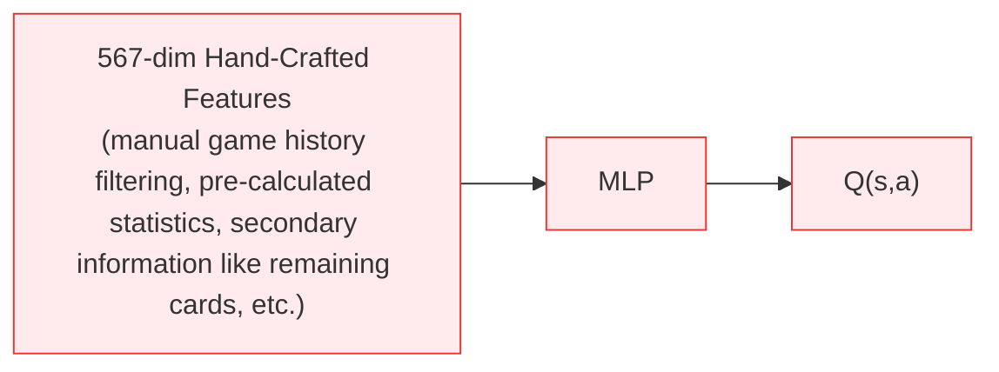
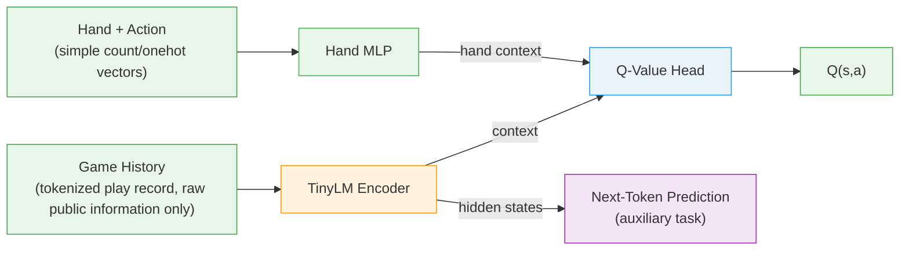
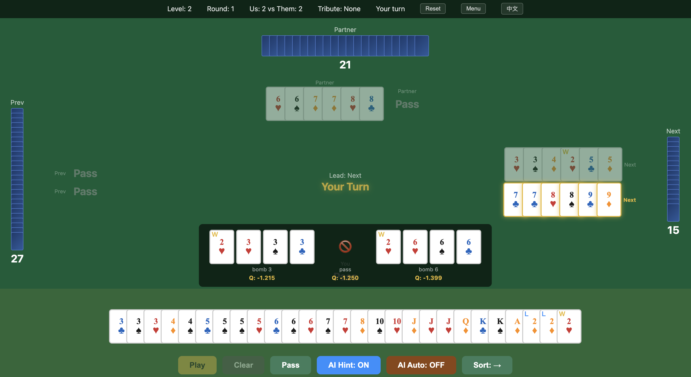

# DanLM: Tokenization Is All You Need to Master Complex Card Games

A game AI that learns entirely from raw game history via self-play reinforcement learning, with **truly zero domain knowledge — no policy priors, no hand-crafted features**, what you see is what you get, surpassing hand-crafted SOTA in GuanDan (掼蛋), a complex 4-player trick-taking card game hugely popular across China.

**Disclaimer: This project was developed through ~100% vibe coding (powered by Claude Opus 4.6). While extensively tested, the code and documentation may contain critical bugs, hallucinations, or inaccuracies.** We are actively working on fixing these issues. Use at your own risk and verify critical results independently. If you encounter any problems, feel free to [open an issue](../../issues).

---

## Architecture

### Previous SOTA (DanZero) — requires domain knowledge



### DanLM (This Work) — zero domain knowledge, learn everything from raw observations



## Key Idea

Existing card game AI systems (DouZero, DanZero, PerfectDou, Suphx, etc.) usually rely on **carefully designed hand-crafted features**, including too much domain knowledge like pre-calculated statistics and secondary information of the game.

**DanLM shows that raw game history speaks for itself.** The input is simply the raw play-by-play game transcript — who played what cards, in order — tokenized like natural language. The model learns what matters from scratch, through self-play RL and causal sequence modeling.

| Aspect | Previous SOTA (DanZero) | DanLM |
|--------|------------------------|------------|
| State features | 567-dim hand-crafted | Raw token sequence |
| Architecture | MLP | TinyLM + MLP |
| Domain knowledge | Yes | No |
| Training | DMC self-play | DMC self-play + NTP |

## Evaluation

### Models

| Model | Main Architecture | State Representation |
|-------|-------------|----------|
| DanZero | MLP | 567-dim hand-crafted |
| DanZero V1T | MLP | 964-dim hand-crafted |
| DanLM V1 | causal Transformer | raw info tokenization (~90 vocab)|

> **DanZero V1T** is our enhanced reproduction of DanZero with bug fixes, stronger state representation, and fully model-driven action selection (original DanZero uses heuristics for tribute). It exceeds the original DanZero's performance under the same training settings, serving as a stronger hand-crafted baseline.

### Metrics

- **Single-Round Win Rate**: One round with a random level, random tribute/back, and random deal. The team whose player finishes first wins. This is a stricter metric with less variance amplification.
- **Whole-Game Win Rate**: A complete game consisting of multiple rounds with level progression from 2 to A. This is the metric used in the original DanZero paper (Table I). Single-round advantages are amplified over multiple rounds (e.g., 54% single-round → ~66% whole-game).

### Baseline Bots

We include **16 competition bots** from the [1st National GuanDan AI Algorithm Competition (首届中国人工智能掼蛋算法大赛)](https://gameai.njupt.edu.cn/gameaicompetition/guandan_machine_code/index.html) as standardized evaluation baselines, consistent with the DanZero paper's evaluation protocol.

**Key finding: competition rankings do NOT reflect actual bot strength.** Many bots have critical bugs in their source code that caused crashes during the competition. For example, njupt-guandan-ai only won a consolation prize due to a None-check bug causing ~49% of games to crash — but it is actually the strongest bot after the fix. **We fixed all bots one by one and evaluated against their bug-free versions.**

See `baselines/` for the full bots collection.

### Results

Evaluation results of DanLM against DanZero, DanZero V1T, and the 5 strongest baseline bots: njupt-guandan-ai, chick-squad, guanglan-iot, egg-expert, and egg-pancake.

Random single-round win rate (1000 rounds, seed=42):

|        | DanZero | DanZero V1T | njupt-guandan-ai | chick-squad | guanglan-iot | egg-expert | egg-pancake |
|--------|--------|--------|--------|--------|--------|--------|--------|
| DanZero | - | - | 71.4% | 74.6% | 77.3% | 78.8% | 79.1% |
| DanZero V1T | 62.1% | - | 77.8% | 80.8% | **81.8%** | **83.2%** | **85.9%** |
| **DanLM** | **65.1%** | **59.6%** | **81.9%** | **82.1%** | 80.9% | 82.3% | **85.9%** |

Whole-game win rate (1000 games, seed=42):

|        | DanZero | DanZero V1T | njupt-guandan-ai | chick-squad | guanglan-iot | egg-expert | egg-pancake |
|--------|--------|--------|--------|--------|--------|--------|--------|
| DanZero | - | - | 95.5% | 98.9% | 98.6% | 99.1% | 99.0% |
| DanZero V1T | 87.5% | - | 99.1% | 99.9% | **100.0%** | **100.0%** | 99.8% |
| **DanLM** | **97.5%** | **74.9%** | **100.0%** | **100.0%** | 99.8% | 99.9% | **99.9%** |

### Quick Start to Reproduce the Results

#### Requirements

- Python 3.12
- macOS ARM64 (Apple Silicon)

#### Install

```bash
pip install torch numpy onnxruntime
pip install fastapi uvicorn  # for UI
```

#### Evaluate

```bash
# DanLM vs random
PYTHONPATH=. python scripts/evaluate.py \
    --model ckpts/DanLM_v1/dansformer_v1_best_eval.pt \
    --games 100

# DanLM vs DanZero V1T (hand-crafted SOTA)
PYTHONPATH=. python scripts/evaluate.py \
    --model ckpts/DanLM_v1/dansformer_v1_best_eval.pt \
    --model-b ckpts/DanZero_v3_rep_v1t/v3_rep_v1t_best_eval_001_int8.onnx \
    --games 500

# DanLM vs baseline bot
PYTHONPATH=. python scripts/evaluate.py \
    --model ckpts/DanLM_v1/dansformer_v1_best_eval.pt \
    --model-b bot:fin-njupt-guandan-ai \
    --games 500

# Whole-game evaluation
PYTHONPATH=. python scripts/evaluate_game.py \
    --model ckpts/DanLM_v1/dansformer_v1_best_eval.pt \
    --model-b ckpts/DanZero_v3_rep_v1t/v3_rep_v1t_best_eval_001_int8.onnx \
    --games 100
```

## Web UI - Enjoy playing with the AI yourself!



Play GuanDan against the AI in your browser with built-in AI Hint support showing Q-value estimates for each legal play.

```bash
PYTHONPATH=. python ui/server.py
# Open http://localhost:8000
```

Choose from 3 AI agents:
- **DanZero V0** — MLP baseline
- **DanZero V1T** — Hand-crafted feature SOTA
- **DanLM V1** — Feature-free TinyLM agent (ours)

## License

Apache License 2.0 with additional non-commercial restriction. See [LICENSE](LICENSE) for details.

Free for academic research and personal use. Commercial use requires written permission from the author.

## References

- **DanZero**: Lu et al., "DanZero: Mastering GuanDan Game with Reinforcement Learning", AAAI 2023. [[paper]](https://arxiv.org/abs/2210.17087)
- **DouZero**: Zha et al., "DouZero: Mastering DouDizhu with Self-Play Deep Reinforcement Learning", ICML 2021. [[paper]](https://arxiv.org/abs/2106.06135) [[code]](https://github.com/kwai/DouZero)
- **PerfectDou**: Yang et al., "PerfectDou: Dominating DouDizhu with Perfect Information Distillation", NeurIPS 2022. [[paper]](https://arxiv.org/abs/2203.16406)
- **Suphx**: Li et al., "Suphx: Mastering Mahjong with Deep Reinforcement Learning", 2020. [[paper]](https://arxiv.org/abs/2003.13590)

## Citation

If you use this work, please cite this repository.
