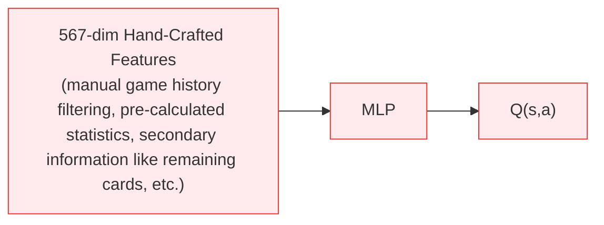
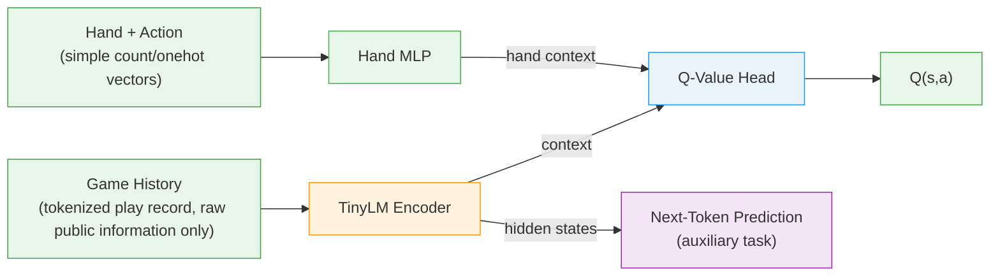

# DanLM: Tokenization Is All You Need to Master Complex Card Games

A game AI that learns entirely from raw game history via self-play reinforcement learning, with **truly zero domain knowledge — no policy priors, no hand-crafted features**, what you see is what you get, surpassing hand-crafted SOTA in GuanDan (掼蛋), a complex 4-player trick-taking card game hugely popular across China.

**Disclaimer: This project was developed through ~100% vibe coding (powered by Claude Opus 4.6). While extensively tested, the code and documentation may contain critical bugs, hallucinations, or inaccuracies.** We are actively working on fixing these issues. Use at your own risk and verify critical results independently. If you encounter any problems, feel free to [open an issue](../../issues).

---

## Architecture

### Previous SOTA (DanZero) — requires domain knowledge



### DanLM (This Work) — zero domain knowledge



## Key Idea

Existing card game AI systems (DouZero, DanZero, PerfectDou, Suphx, etc.) usually rely on **carefully designed hand-crafted features**, including too much domain knowledge like pre-calculated statistics and secondary information of the game.

**DanLM shows that raw game history speaks for itself.** The input is simply the raw play-by-play game transcript — who played what cards, in order — tokenized like natural language. The model learns what matters from scratch, through self-play RL and causal sequence modeling.

| Aspect | Previous SOTA (DanZero) | DanLM |
|--------|------------------------|------------|
| State features | 567-dim hand-crafted | Raw token sequence |
| Architecture | MLP | TinyLM + MLP |
| Domain knowledge | Yes | No |
| Training | DMC self-play | DMC self-play + NTP |

## Results

### Head-to-Head: DanLM vs DanZero V1T (500 games, seed=42)

> **DanZero V1T** is our enhanced reproduction of DanZero with bug fixes, a stronger state representation, and model-driven tribute selection. It already exceeds the original DanZero paper's results, serving as a strong hand-crafted baseline.

| Metric | Result |
|--------|--------|
| Single-round win rate | **54.2%** |
| Whole-game win rate | **66.4%** (332/500) |

### Model Progression

```
DanZero V0 (567-dim hand-crafted) < DanZero V1T (964-dim hand-crafted) < DanLM V1 (zero hand-crafted)
```

DanLM surpasses both hand-crafted models while using **no domain knowledge at all**.

For detailed evaluation protocol, baseline bot analysis, and full results, see [docs/results.md](docs/results.md).

## Quick Start

### Requirements

- Python 3.12
- macOS ARM64 (Apple Silicon)

### Install

```bash
pip install torch numpy onnxruntime
pip install fastapi uvicorn  # for UI
```

### Evaluate

```bash
# DanLM vs random
PYTHONPATH=. python scripts/evaluate.py \
    --model ckpts/DanLM_v1/dansformer_v1_best_eval.pt \
    --games 100

# DanLM vs DanZero V1T (hand-crafted SOTA)
PYTHONPATH=. python scripts/evaluate.py \
    --model ckpts/DanLM_v1/dansformer_v1_best_eval.pt \
    --model-b ckpts/DanZero_v3_rep_v1t/v3_rep_v1t_best_eval_001_int8.onnx \
    --games 500

# DanLM vs baseline bot
PYTHONPATH=. python scripts/evaluate.py \
    --model ckpts/DanLM_v1/dansformer_v1_best_eval.pt \
    --model-b bot:fin-njupt-guandan-ai \
    --games 500

# Whole-game evaluation
PYTHONPATH=. python scripts/evaluate_game.py \
    --model ckpts/DanLM_v1/dansformer_v1_best_eval.pt \
    --model-b ckpts/DanZero_v3_rep_v1t/v3_rep_v1t_best_eval_001_int8.onnx \
    --games 100
```

### Play (Web UI)

```bash
PYTHONPATH=. python ui/server.py
# Open http://localhost:8000
```

Choose from 3 AI agents:
- **DanZero V0** — MLP baseline
- **DanZero V1T** — Hand-crafted feature SOTA
- **DanLM V1** — Feature-free TinyLM agent (ours)

## Models

| Model | Architecture | Features | Parameters |
|-------|-------------|----------|------------|
| DanZero V0 | 5-layer MLP | 567-dim hand-crafted | ~2.4M |
| DanZero V1T | 5-layer MLP | 964-dim hand-crafted | ~3.0M |
| DanLM V1 | TinyLM (3 blocks) + MLP | Raw tokens (91 vocab) | ~5.2M |

## Baseline Bots

This repo includes **16 bug-fixed competition bots** from the [1st National GuanDan AI Algorithm Competition (首届中国人工智能掼蛋算法大赛)](https://gameai.njupt.edu.cn/gameaicompetition/guandan_machine_code/index.html), serving as standardized evaluation baselines. Key findings from our tournament analysis:

- The competition rankings do not reflect actual bot strength
- The strongest bot (fin-njupt-guandan-ai) only won a consolation prize due to a bug causing ~49% of games to crash
- After bug fixes, the true top 3 are: njupt-guandan-ai > egg-pancake > chick-squad

See `baselines/` for the full collection.

## What is GuanDan?

GuanDan (掼蛋) is a 4-player partnership trick-taking card game popular in China. It uses two standard decks (108 cards), features wild cards, level progression, and a tribute system. The game has ~10^36 information sets, making it significantly more complex than most card games studied in AI research.

## License

Apache License 2.0 with additional non-commercial restriction. See [LICENSE](LICENSE) for details.

Free for academic research and personal use. Commercial use requires written permission from the author.

## References

- **DanZero**: Lu et al., "DanZero: Mastering GuanDan Game with Reinforcement Learning", AAAI 2023. [[paper]](https://arxiv.org/abs/2210.17087)
- **DouZero**: Zha et al., "DouZero: Mastering DouDizhu with Self-Play Deep Reinforcement Learning", ICML 2021. [[paper]](https://arxiv.org/abs/2106.06135) [[code]](https://github.com/kwai/DouZero)
- **PerfectDou**: Yang et al., "PerfectDou: Dominating DouDizhu with Perfect Information Distillation", NeurIPS 2022. [[paper]](https://arxiv.org/abs/2203.16406)
- **Suphx**: Li et al., "Suphx: Mastering Mahjong with Deep Reinforcement Learning", 2020. [[paper]](https://arxiv.org/abs/2003.13590)

## Citation

If you use this work, please cite this repository.
